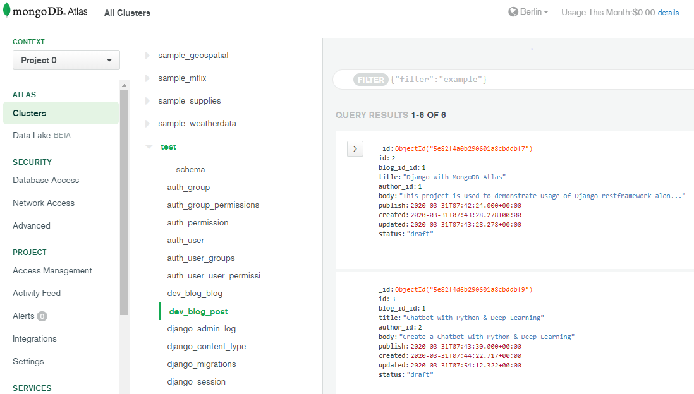

# BLOG application - Django Rest with MongoDB Atlas

This project is used to demonstrate usage of Django restframework along with NoSQL 
Mongo DB. MongoDB Atlas is a fully managed cloud database which provides database-as-a-service
on the cloud provider of your choice (AWS, Azure & Google). Here I have selected AWS cloud
provider. 
This Blog application showcase simple CRUD operations using django rest and mongo db


## MongoDB Atlas
You can create free MongoDB Cluster in [Atlas](https://www.mongodb.com/cloud/atlas) and use for your trial application.
You will find various useful blogs which describes the cluster creation and usage of same.


### Libraries used:
    Python 3.8
    Django 3
    Django Restframework
    Djongo - for MongoDB Integration
    MongoDB Atlas cloud cluster (4.2.3)
    drf-yasg - Swagger generator


### Set up Virtual Environment
Create Virtual environment

`python -m venv env`

Then activate the virtual enviornment

In Linux

`source env/bin/activate`

In windows

`cd env/Scripts`

`activate`

To deactivate the virtual environment

`deactivate`


### Install Libraries

Use below command to install all required libraries in your virtual env

    pip install -r requirements.txt


### Mongo DB Setup

Change your settings.py file to setup Mongo DB:

    
    DATABASES = {
        'default': {
        'ENGINE': 'djongo',
        'NAME': <db_name>,
        'HOST': 'mongodb+srv://<username>:'+ urllib.parse.quote(<password>) +
                '@cluster1109-2itwv.mongodb.net/test?retryWrites=true&w=majority',
        'USER': <username>,
        'PASSWORD': <password>,
        }
    }
    


Run below commands to check the Mongo DB Atlas connection:

`python manage.py makemigrations` and `python manage.py migrate`


If you see DB connection error like 'pymongo.errors.ServerSelectionTimeoutError: localhost:27017' then
you might need to tweak below change in pymongo/mongo_client.py as there is still bug 
in current version of djongo (1.3.1). Instead of connecting to passed HOST in Database settings 
it always tries to connect to localhost.

1) yourvirtualenvfolder/lib/site-packages/pymongo/mongo_client.py

2) Search for this part of code:
    ```
   class MongoClient(common.BaseObject):
        HOST = "localhost"
        PORT = 27017
   ```
3) Substitute "localhost" with your SRV address, for example:
    ```
    class MongoClient(common.BaseObject):
        HOST = "mongodb+srv://dnsServerName/test"
        PORT = 27017
   ```
4) Save the file, run migrations again and you're connected to MongoDB Atlas.


### Run application
Use below command to run your django application

    python manage.py runserver 8080


## APIs and Documentation

### Blog service

This service is used to get information about a blog. It provides blog name, title and 
owner of the blog.

    url: http://localhost:8080/dev-blog/blog/

You can lookup all blogs, blog by id (pk), you can create new blog, update, partial update and
delete a blog. You can get more details in swagger:

    Swagger url: http://localhost:8080/swagger/

Note: Please specify the port on which you are running your application


### Blog Post Service

This service is used to get information about a blog posts. It provides post title, author,
content of the post etc.

You can lookup all blog posts, post by id (pk), you can create new post, update, partial update and
delete a post for any blog. 


### Data in MongoDB Atlas

Once you perform few CRUD operations, you can check data in MongoDB Atlas


